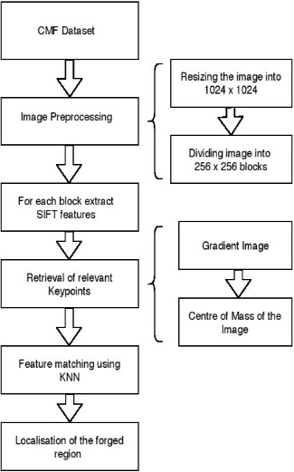
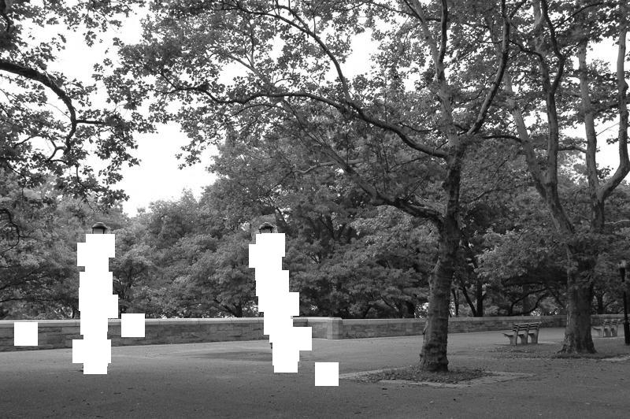

# Copy Move Forgery Detection

Detection of copy-move forgery is performed on MICC-F220[1] dataset. It can also be used for creating segmented mask.

The implemented approach uses SIFT feature extraction method for matching features
which are copied within an image. In this method, feature matching is performed through KNN approach.

Initially, the raw image is segmented into 256 X 256 equally sized blocks for extarcting features.
Then feature matching is performed across each blocks to determine the copied region. Finally,
at the matched feature location a matrix of 30 X 30 is created to detect the whole copied region.

To test an image, simply move the image file to the test_images directory

### To execute the code:

1. Open a Terminal/Shell
2. ``cd forgery_detect``
3. Run the command - ``python main.py``
4. The output images will be generated in the output_images directory

To install all the requirements:

``pip install -r requirements.txt``

### Flow Diagram

### Results

Original Image

Output Image

The following papers provide references to the ideas behind the above proposal:

[1] I. Amerini, L. Ballan, R. Caldelli, A. Del Bimbo, G. Serra. “A SIFT-based forensic method for copy-move attack detection and transformation recovery”, IEEE Transactions on Information Forensics and Security, vol. 6, issue 3, pp. 1099-1110, 2011.

If you wish to collaborate in further projects, please drop me a mail at: bn.deepankan@gmail.com